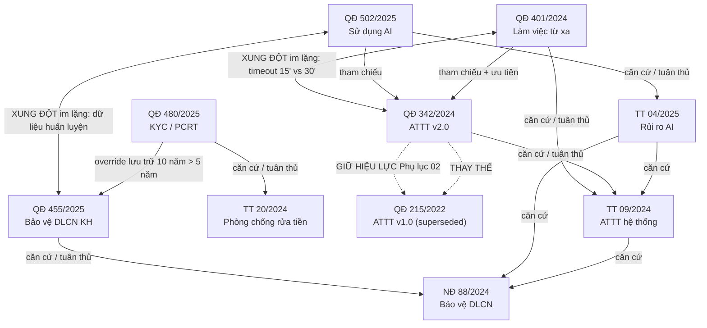

# Bộ văn bản tuân thủ MÔ PHỎNG — Ground Truth (đáp án cho test RAG + Graph)

> ⚠️ **Toàn bộ là DỮ LIỆU GIẢ LẬP.** Ngân hàng "TMCP Đông Đô (DongDoBank – DDB)" là hư cấu;
> mọi số hiệu văn bản, tên người ký, nội dung điều khoản đều bịa để kiểm thử hệ thống —
> **không phải văn bản pháp luật hay quy định thật**. Mỗi trang PDF có dòng disclaimer ở lề
> trên + lề dưới (đặt NGOÀI vùng body để không làm nhiễu VLM parsing).

Bộ **10 PDF** này được thiết kế để **cố tình chứa** các quan hệ mà 3 pain point của đề hackathon
cần xử lý: (P1) hết hiệu lực & thay thế, (P2) overlap/xung đột điều khoản, (P3) liên kết văn bản
Nhà nước ↔ entity văn bản tuân thủ nội bộ. Ngoài ra bổ sung các archetype test RAG: **liệt kê**,
**tra bảng biểu giá trị**, **hỏi specific**. File này là **đáp án** để chấm extraction & câu trả lời.

---

## 1. Danh mục văn bản (nodes cấp document)

| # | File | Số hiệu | Loại | Cấp | Ngày BH | Hiệu lực từ | Trạng thái |
|---|------|---------|------|-----|---------|-------------|------------|
| 1 | `01_ND_88...` | 88/2024/NĐ-CP | Nghị định | Nhà nước (Chính phủ) | 15/10/2024 | 01/01/2025 | Còn hiệu lực |
| 2 | `02_TT_09...` | 09/2024/TT-NHNN | Thông tư | Nhà nước (NHNN) | 20/05/2024 | 01/07/2024 | Còn hiệu lực |
| 3 | `03_TT_04...` | 04/2025/TT-NHNN | Thông tư | Nhà nước (NHNN) | 28/03/2025 | 01/06/2025 | Còn hiệu lực |
| 4 | `04_QD_215...` | 215/2022/QĐ-DDB | Quyết định | Nội bộ DDB | 10/03/2022 | 10/03/2022 | **BỊ THAY THẾ** (một phần) |
| 5 | `05_QD_342...` | 342/2024/QĐ-DDB | Quyết định | Nội bộ DDB | 15/08/2024 | 01/09/2024 | Còn hiệu lực (bản hiện hành ATTT) |
| 6 | `06_QD_401...` | 401/2024/QĐ-DDB | Quyết định | Nội bộ DDB | 12/11/2024 | 01/12/2024 | Còn hiệu lực |
| 7 | `07_QD_455...` | 455/2025/QĐ-DDB | Quyết định | Nội bộ DDB | 20/02/2025 | 01/03/2025 | Còn hiệu lực |
| 8 | `08_QD_502...` | 502/2025/QĐ-DDB | Quyết định | Nội bộ DDB | 15/05/2025 | 01/06/2025 | Còn hiệu lực |
| 9 | `09_TT_20...` | 20/2024/TT-NHNN | Thông tư | Nhà nước (NHNN) | 30/07/2024 | 01/09/2024 | Còn hiệu lực |
| 10 | `10_QD_480...` | 480/2025/QĐ-DDB | Quyết định | Nội bộ DDB | 10/04/2025 | 01/05/2025 | Còn hiệu lực |

---

## 2. Đồ thị quan hệ (edges) — ground truth cho Graph extraction

### 2.1 Quan hệ `CĂN_CỨ` / `COMPLIES_WITH` (nội bộ → Nhà nước) — **P3**
| Từ (nội bộ) | Đến (Nhà nước) | Bằng chứng |
|---|---|---|
| QĐ 342/2024 | TT 09/2024/TT-NHNN | Căn cứ + Điều 3 "phù hợp Điều 6 TT 09", Điều 8 dẫn Điều 12 TT 09 |
| QĐ 401/2024 | TT 09/2024/TT-NHNN | Phần Căn cứ |
| QĐ 455/2025 | NĐ 88/2024/NĐ-CP | Căn cứ + Điều 7 dẫn "Điều 8 NĐ 88", Điều 9 dẫn "Điều 13 NĐ 88" |
| QĐ 502/2025 | TT 04/2025/TT-NHNN | Căn cứ + Điều 4 dẫn "Điều 7 TT 04", Điều 9 dẫn "Điều 3 TT 04" |
| QĐ 480/2025 | TT 20/2024/TT-NHNN | Căn cứ + Điều 2/4/8 dẫn TT 20 |

### 2.2 Quan hệ `CĂN_CỨ` (Nhà nước → Nhà nước / Luật)
| Từ | Đến |
|---|---|
| TT 09/2024 | NĐ 88/2024 |
| TT 04/2025 | NĐ 88/2024 **và** TT 09/2024 |
| TT 20/2024 | Luật Phòng chống rửa tiền 2022 (external) |

### 2.3 Quan hệ `THAM_CHIẾU` (nội bộ → nội bộ)
| Từ | Đến | Bằng chứng |
|---|---|---|
| QĐ 401/2024 | QĐ 342/2024 | Điều 4.2 (tuyên bố ưu tiên), Điều 5 |
| QĐ 502/2025 | QĐ 342/2024 | Điều 8 (ATTT cho hệ thống AI) |
| QĐ 480/2025 | QĐ 455/2025 | Điều 8 — thời hạn 10 năm áp dụng **thay cho** 5 năm của QĐ 455 |

### 2.4 Quan hệ `THAY_THẾ` (supersession) — **P1**
| Từ | Đến | Loại | Bằng chứng |
|---|---|---|---|
| QĐ 342/2024 | QĐ 215/2022 | **Thay thế một phần (partial)** | Điều 1.2 thay thế toàn bộ; **Điều 1.3 GIỮ hiệu lực Phụ lục 02** |
| QĐ 215/2022 | TT 18/2018/TT-NHNN | căn cứ (luật đời cũ — dangling ref) | Phần Căn cứ |

> **Bẫy P1 quan trọng:** QĐ 215 "bị thay thế" nhưng **Phụ lục 02 (Danh mục hệ thống trọng yếu)
> vẫn còn hiệu lực**. Hệ thống phải trả lời "hệ thống trọng yếu gồm gì" bằng cách vẫn dẫn Phụ lục
> 02 của QĐ 215, đồng thời KHÔNG dùng các điều khoản khác của QĐ 215 (mật khẩu 8 ký tự, log 6
> tháng, MFA khuyến khích...) vì đã hết hiệu lực.

---

## 3. Entity dùng chung (nodes cấp khái niệm) — để test entity extraction & linking

| Entity | Xuất hiện tại | Ghi chú test |
|---|---|---|
| **Mật khẩu** | QĐ215, QĐ342, QĐ401 | giá trị mâu thuẫn (xem §4) |
| **Xác thực đa yếu tố (MFA)** | TT09, QĐ215, QĐ342, QĐ401 | QĐ215 "khuyến khích" → QĐ342 "bắt buộc" (theo TT09) |
| **Nhật ký / Log** | TT09, QĐ215, QĐ342 | 6 tháng (215) → 12 tháng (342, khớp TT09) |
| **Khóa phiên (session timeout)** | QĐ215, QĐ342, QĐ401 | 15' nội bộ vs 30' từ xa (§4) |
| **Hệ thống thông tin trọng yếu** | TT09 (Cấp độ 3+), QĐ215 (Phụ lục 02), QĐ342 | link supersession một phần |
| **Phân loại cấp độ hệ thống (1–5)** | TT09 Đ3 (bảng) | test tra bảng: core banking = Cấp độ 4 |
| **Dữ liệu cá nhân** | NĐ88, TT09, TT04, QĐ401, QĐ455, QĐ502, QĐ480 | entity trung tâm liên kết Nhà nước↔nội bộ |
| **Sự đồng ý (consent)** | NĐ88, TT04, QĐ455 | mấu chốt xung đột §4 |
| **Huấn luyện mô hình AI** | NĐ88(Đ9), TT04(Đ9), QĐ455(Đ5), QĐ502(Đ6) | mấu chốt xung đột §4 |
| **Phân loại rủi ro AI (4 mức)** | TT04 Đ3 (bảng), QĐ502 Đ9 | test tra bảng: chấm điểm tín dụng = rủi ro Cao |
| **Human-in-the-loop / quyết định tín dụng** | TT04(Đ7), QĐ502(Đ4) | overlap ĐỒNG NHẤT (không xung đột) |
| **Mã hóa** | NĐ88, TT09, QĐ342(Đ7 bảng), QĐ401, QĐ455 | tiêu chuẩn cụ thể: AES-256, TLS 1.2 |
| **Ẩn danh (anonymization)** | TT04(Đ9.2), QĐ502(Đ6) | định nghĩa gây tranh cãi trong xung đột §4 |
| **KYC / Nhận biết khách hàng** | TT20, QĐ480 | cặp Nhà nước↔nội bộ mới |
| **Ngưỡng giao dịch báo cáo** | TT20 Đ5 (bảng), QĐ480 Đ4 (bảng) | test tra bảng: tiền mặt ≥400tr (NN) / ≥300tr (nội bộ) |
| **Dấu hiệu giao dịch đáng ngờ** | TT20 Đ6 (8 mục), QĐ480 Đ6 (5 mục) | test liệt kê |
| **Thời hạn lưu trữ** | NĐ88/QĐ455 (5 năm), QĐ502 (24 tháng AI), TT20/QĐ480 (10 năm KYC) | 3 mốc khác nhau theo loại dữ liệu (§4) |
| **Xử phạt vi phạm hành chính** | NĐ88 Đ14 (bảng) | test tra bảng giá trị: 80–300 triệu theo hành vi |

---

## 4. Ma trận OVERLAP / XUNG ĐỘT — **P2** (phần quan trọng nhất)

### 4.1 Xung đột CÓ tuyên bố ưu tiên (dễ — chỉ cần đọc câu ưu tiên)
| Chủ đề | Văn bản A | Văn bản B | Mâu thuẫn | Ưu tiên tuyên bố | Kết luận đúng |
|---|---|---|---|---|---|
| Độ dài mật khẩu | QĐ342 Đ2: **12 ký tự**, 180 ngày | QĐ401 Đ4: **8 ký tự** | Có (12 vs 8) | **CÓ** — QĐ401 Đ4.2 "ưu tiên QĐ342" | Áp dụng **12 ký tự** (QĐ342) |
| Thời hạn lưu KYC vs DLCN | QĐ480 Đ8: **10 năm** (KYC) | QĐ455 Đ7: **5 năm** (DLCN) | Bề ngoài mâu thuẫn | **CÓ** — QĐ480 Đ8 nói rõ "áp dụng thay cho 5 năm do là pháp luật chuyên ngành"; NĐ88 Đ8 có carve-out "trừ pháp luật chuyên ngành" | **KHÔNG phải xung đột thật**: hồ sơ KYC lưu **10 năm** (chuyên ngành thắng). Hệ thống KHÔNG được báo động giả. |

### 4.2 Xung đột KHÔNG tuyên bố ưu tiên (khó — hệ thống phải tự phát hiện & cảnh báo)
| Chủ đề | Văn bản A | Văn bản B | Mâu thuẫn | Ưu tiên tuyên bố | Kỳ vọng hệ thống |
|---|---|---|---|---|---|
| **Khóa phiên** | QĐ342 Đ5: **15 phút** (nội bộ) | QĐ401 Đ5: **30 phút** (từ xa) | Mập mờ — cùng chủ đề, khác phạm vi | **KHÔNG** (câu ưu tiên QĐ401 chỉ phủ "mật khẩu và xác thực", **không phủ timeout**) | **Cảnh báo** 2 giá trị theo phạm vi; không tự chọn 1 |
| **Dữ liệu huấn luyện AI** | QĐ455 Đ5: dùng DLCN huấn luyện **phải có đồng ý riêng** | QĐ502 Đ6: dữ liệu **đã ẩn danh** dùng huấn luyện, lưu **24 tháng**, không nhắc đồng ý | Có — QĐ502 mở "cửa" ẩn danh mà QĐ455 không đề cập | **KHÔNG** — hai văn bản không dẫn chiếu nhau ở điểm này | **Cảnh báo xung đột** + nêu mấu chốt: *dữ liệu ẩn danh có còn là "dữ liệu cá nhân" không?* (định nghĩa NĐ88 Đ2) |

> **Ca "dữ liệu huấn luyện AI" là showcase mạnh nhất:** vừa là **xung đột im lặng** (P2), vừa kéo
> theo **văn bản Nhà nước** (NĐ88 Đ5/Đ9, TT04 Đ9) để phân xử (P3), vừa cần **định nghĩa entity**
> ("ẩn danh" vs "dữ liệu cá nhân") để lập luận. Một câu chạm cả 3 pain point.
>
> **Ca "lưu trữ 10 vs 5 năm" (§4.1) là bẫy ngược:** trông như xung đột nhưng KHÔNG phải — test xem
> hệ thống có hiểu **carve-out pháp luật chuyên ngành** thay vì báo động giả.

### 4.3 Overlap ĐỒNG NHẤT (không xung đột — test để tránh báo động giả)
| Chủ đề | Văn bản | Trạng thái |
|---|---|---|
| MFA bắt buộc cho truy cập từ xa | TT09 Đ6 ↔ QĐ342 Đ3 | Khớp (nội bộ tuân thủ Nhà nước) |
| Log ≥ 12 tháng | TT09 Đ10 ↔ QĐ342 Đ4 | Khớp |
| Human-in-the-loop cho từ chối tín dụng | TT04 Đ7 ↔ QĐ502 Đ4 | Khớp |
| Thời hạn lưu DLCN ≤ 5 năm | NĐ88 Đ8 ↔ QĐ455 Đ7 | Khớp |
| Ngưỡng báo cáo giao dịch | TT20 Đ5 ↔ QĐ480 Đ4 (300tr **chặt hơn** 400tr) | Nội bộ nghiêm ngặt hơn — hợp lệ, KHÔNG xung đột |

---

## 5. Bộ câu hỏi kiểm thử gợi ý (với đáp án đúng)

### 5.1 Nhóm cần Graph (P1/P2/P3)
| # | Câu hỏi | Pain point | Đáp án đúng kỳ vọng |
|---|---|---|---|
| Q1 | "Mật khẩu đăng nhập hệ thống nội bộ tối thiểu bao nhiêu ký tự?" | P1+P2 | **12 ký tự** (QĐ342 Đ2). QĐ215 (8) đã bị thay thế; QĐ401 (8) tự nhường ưu tiên QĐ342. |
| Q2 | "Danh mục hệ thống thông tin trọng yếu của DDB gồm những gì?" | P1 (partial) | 4 hệ thống ở **Phụ lục 02 QĐ215** — *vẫn hiệu lực* dù QĐ215 bị thay thế (QĐ342 Đ1.3). |
| Q3 | "Nhật ký hệ thống phải lưu tối thiểu bao lâu?" | P1 | **12 tháng** (QĐ342 Đ4, khớp TT09 Đ10). Không dùng "6 tháng" của QĐ215. |
| Q4 | "Phiên làm việc tự động khóa sau bao nhiêu phút?" | P2 (im lặng) | Cảnh báo **2 giá trị theo phạm vi**: 15' nội bộ (QĐ342), 30' từ xa (QĐ401). |
| Q5 | "DDB có được dùng dữ liệu khách hàng để huấn luyện AI không?" | P2+P3 | Nêu **xung đột**: QĐ455 đòi đồng ý; QĐ502 cho phép nếu **ẩn danh** (≤24 tháng); dẫn NĐ88 Đ5/Đ9 + TT04 Đ9; nêu mấu chốt định nghĩa "ẩn danh". |
| Q6 | "Quy định ATTT của DDB dựa trên văn bản pháp luật nào?" | P3 | QĐ342 & QĐ401 **căn cứ TT09/2024/TT-NHNN**; TT09 lại **căn cứ NĐ88/2024/NĐ-CP**. |
| Q7 | "Hồ sơ nhận biết khách hàng (KYC) phải lưu trữ bao lâu?" | P2 (carve-out) | **10 năm** (QĐ480 Đ8 / TT20 Đ10) — KHÔNG phải 5 năm; chuyên ngành PCRT override quy định DLCN. |
| Q8 | "Quy chế An toàn thông tin nào đang có hiệu lực?" | P1 | **QĐ342/2024 (v2.0)**; QĐ215/2022 đã bị thay thế (trừ Phụ lục 02). |

### 5.2 Nhóm test RAG thuần: LIỆT KÊ / TRA BẢNG / SPECIFIC
| # | Câu hỏi | Archetype | Đáp án đúng kỳ vọng |
|---|---|---|---|
| Q9 | "Liệt kê các dấu hiệu giao dịch đáng ngờ." | Liệt kê | 8 dấu hiệu ở **TT20 Đ6** (hoặc 5 mục nội bộ QĐ480 Đ6). Chấm độ đầy đủ (recall liệt kê). |
| Q10 | "Giao dịch tiền mặt bao nhiêu thì phải báo cáo?" | Tra bảng | **≥ 400.000.000 VND** (TT20 Đ5); nội bộ DDB đặt chặt hơn **≥ 300.000.000 VND** (QĐ480 Đ4). |
| Q11 | "Các ứng dụng AI nào bị nghiêm cấm?" | Liệt kê | 5 mục ở **TT04 Đ4** (chấm điểm công dân, tín dụng tự động hoàn toàn, nhận diện cảm xúc để tuyển dụng/tín dụng, khai thác nhóm dễ tổn thương, sinh trắc học ngoài xác thực). |
| Q12 | "Mức phạt khi chuyển dữ liệu cá nhân ra nước ngoài trái phép là bao nhiêu?" | Tra bảng giá trị | **200–300 triệu đồng** (NĐ88 Đ14). |
| Q13 | "Hệ thống Core Banking thuộc cấp độ mấy?" | Tra bảng | **Cấp độ 4** (TT09 Đ3, và Phụ lục 02 QĐ215). |
| Q14 | "Quyền của khách hàng đối với dữ liệu cá nhân gồm những gì?" | Liệt kê | 7 quyền ở **NĐ88 Đ12** (biết, đồng ý, truy cập, xóa, rút đồng ý, phản đối tiếp thị, khiếu nại). |
| Q15 | "Sự cố nghiêm trọng (rò rỉ DLCN) phải báo cáo NHNN trong bao lâu?" | Tra bảng / specific | **Trong 04 giờ** (TT09 Đ12). |
| Q16 | "Tiêu chuẩn mã hóa dữ liệu khi lưu trữ của DDB là gì?" | Specific / tra bảng | **AES-256** (QĐ342 Đ7); dữ liệu truyền TLS 1.2 trở lên. |

---

## 6. Cách dùng cho hackathon

1. **Ingest** cả 10 PDF qua pipeline (upload → VLM parse → contextual chunk → index). Disclaimer đã
   đặt ngoài body nên parsed_text sạch.
2. **RAG hiện tại (agentic + hybrid)** đủ để trả lời tốt nhóm §5.2 (liệt kê / tra bảng / specific) +
   Q3, Q6 — dùng làm **baseline "RAG-only"**.
3. **Cần graph layer** để trả lời đúng Q1, Q2, Q4, Q5, Q7, Q8 — vì phải đi theo cạnh `THAY_THẾ`,
   `ưu tiên`, `xung đột`, `carve-out`. Đây là phần chứng minh "vì sao cần Graph KB": so sánh
   **RAG thường vs RAG + Graph** trên đúng nhóm §5.1.
4. Chấm extraction bằng §2 (edges) và §3 (entities); chấm conflict-detection bằng §4 (đặc biệt lưu
   ý 2 ca bẫy: xung đột im lặng ở §4.2 phải phát hiện, còn ca carve-out §4.1 KHÔNG được báo động giả).
